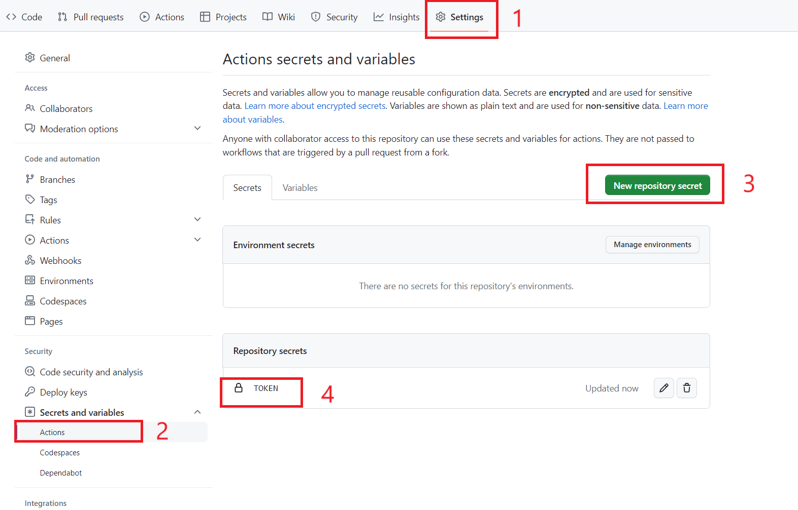

# PUSHPLUS微信推送 GitHub Action


## 使用方法

1. 将 token 添加到仓库的 Actions secrets 中，命名为 token 

  

2. 在 workflow 中使用，例子如下：

```yml
- uses: josStorer/get-current-time@v2.0.2
  id: current-time
  with:
    format: YYYYMMDD-HH
    utcOffset: "+08:00"
- uses: easychen/github-action-server-chan@v1.0.0
  with:
    sendkey: ${{ secrets.sendkey }}
    title: "server酱Action更新啦 ${{ steps.current-time.outputs.formattedTime }}"
    desp: "可以为空。支持Markdown"
- uses: xhnmt/github-action-pushplus@v1.0.0
  with:
    token: ${{ secrets.token }}
    title: "PUSHPLUS推送 ${{ steps.current-time.outputs.formattedTime }}"
    content: "不能为空。默认HTML模板"
```

一个完整的例子：

在仓库根目录新建 `.github/workflows/test.yml`，内容如下：

```yaml
name: 'build-test'
on:
  push:
jobs:
  test:
    runs-on: ubuntu-latest
    steps:
      - name: PUSHPLUS推送通知
        uses: xhnmt/github-action-pushplus@v1.0.0
        with:
          token: ${{ secrets.token }}
          title: "我是一个小测试😝"
          content: "我是一个小测试😝"
```
